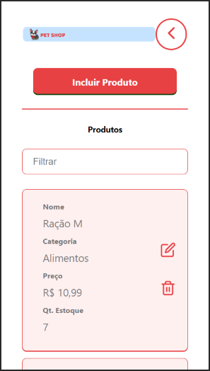

  <!---->

# Project
<strong>Pet Shop - Web App</strong>

This project aims to present a Web Application that will allow the consultation and maintenance of products from a Pet Shop online store.

 

# Technologies

- [Node.js](https://nodejs.org/en)
- [React](https://reactjs.org)

 

# Backend
Developed with: <strong>Node.js</strong>

 

# Frontend
Developed with: <strong>React</strong>

 

Snapshots:

  <!--
  
  
  
  -->

 

# Videos
<!--
- [Medidor de Consumo - Web App Demo](https://youtu.be/ysfJrAA-LAE)
- [Fluxograma do Projeto](https://youtu.be/lR0X3cR9dAk)
- [Backend (Node.js) - Parte 1](https://youtu.be/yT_jV0aznuc)
- [Backend (Node.js) - Parte 2](https://youtu.be/7e_3LmQipsA)
- [Frontend (React)](https://youtu.be/nTU33jcWwQI)
-->

 

# JSON Files

- [Insomnia JSON - Local](https://drive.google.com/file/d/1IwBZAnAgw3hlTXABCDlA7O93FX9OxpL-/view?usp=sharing)
- [Insomnia JSON - Heroku](https://drive.google.com/file/d/1p9UctJgnQWPRKQuuTm1kjKS5LXFwk7OA/view?usp=sharing)
