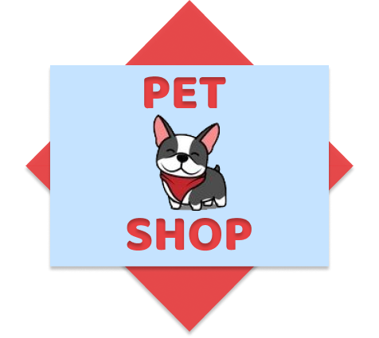

  

# Project

<strong>Pet Shop - Web App</strong>

This project aims to present a Web Application that will allow the consultation and maintenance of products from a Pet Shop online store.

 

# Stack

- [Node.js](https://nodejs.org/en)
- [React](https://reactjs.org)

 

# Backend

Developed with: <strong>Node.js</strong>
 
 

To Install: <strong>npm install</strong>
 
To Execute: <strong>npm start</strong>
 

Test URL Examples (Heroku):
 
<strong>Login</strong> https://petshop-webapp-b.herokuapp.com/login
 
<strong>GET user</strong> https://petshop-webapp-b.herokuapp.com/user
 
 
<strong>POST user</strong> https://petshop-webapp-b.herokuapp.com/user
 
JSON Example --> {"name": "Usuário 1","email": "nome@email.com","pwd": "abc123"}
 
 
<strong>GET product</strong> https://petshop-webapp-b.herokuapp.com/product
 
<strong>GET product (Query Parameters: page)</strong> https://petshop-webapp-b.herokuapp.com/product?page=1
 
<strong>GET product (Query Parameters: page & name)</strong> https://petshop-webapp-b.herokuapp.com/product?page=1&name=nameProduct
 
<strong>GET product (Query Parameters: page & name & description)</strong> https://petshop-webapp-b.herokuapp.com/product?page=1&name=nameProduct&description=descriptionProduct
 
<strong>GET product (Query Parameters: page & name & description & category)</strong> https://petshop-webapp-b.herokuapp.com/product?page=1&name=nameProduct&description=descriptionProduct&category=categoryProduct
 
 
<strong>POST product</strong> https://petshop-webapp-b.herokuapp.com/product
 
<strong>JSON Example --> </strong> Content: {"name": "Coleira","description": "Coleira p/ Cachorro","category": "Acessórios","price": "55.66","stock_quantity": "9"}; (Header: Authorization - Value: (ID user))
 
 
<strong>DELETE product</strong> https://petshop-webapp-b.herokuapp.com/product/1
 
(Header: Authorization - Value: (ID user))

 
<strong>-- See JSON Files --</strong>

 

# Frontend

Developed with: <strong>React</strong>
 
 

To Install: <strong>npm install</strong>
 
To Execute: <strong>npm start</strong>
 
 

- External link Web App: [https://petshop-webapp-f.herokuapp.com](https://petshop-webapp-f.herokuapp.com)
 

Snapshots:

  
  

 

  
  

 

# Videos

- [Pet Shop - Web App (Backend) - Parte 1](https://youtu.be/K7iKAAvOhL4)
- [Pet Shop - Web App (Backend) - Parte 2](https://youtu.be/iY7X5dLG4xE)
- [Pet Shop - Web App (Frontend)](https://youtu.be/H3SMJeNr58M)
- [Pet Shop - Web App (Demo)](https://youtu.be/5HedMW7Hzrw)

 

# JSON Files

- [Insomnia JSON - Localhost](https://drive.google.com/file/d/1Cs2xnDOyUVIrRHF9LUHwk0YhhZX_C-EQ/view?usp=sharing)
- [Insomnia JSON - Heroku](https://drive.google.com/file/d/1OGNx17yfXoh9AvmVhP4jX2TFlogDBBvK/view?usp=sharing)
